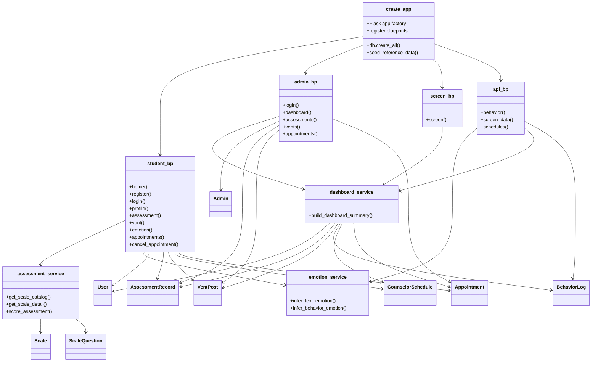

# 类谱系树源文件

## 1. 用途
- 对应课程报告中的类谱系树或模块关系图。
- 建议导出为 `fig-12-class-tree.png` 后插入报告第三章概要设计部分。

## 2. Mermaid 源码

```mermaid
classDiagram
    class create_app {
        +Flask app factory
        +register blueprints
        +db.create_all()
        +seed_reference_data()
    }

    class student_bp {
        +home()
        +register()
        +login()
        +profile()
        +assessment()
        +vent()
        +emotion()
        +appointments()
        +cancel_appointment()
    }

    class admin_bp {
        +login()
        +dashboard()
        +assessments()
        +vents()
        +appointments()
    }

    class screen_bp {
        +screen()
    }

    class api_bp {
        +behavior()
        +screen_data()
        +schedules()
    }

    class assessment_service {
        +get_scale_catalog()
        +get_scale_detail()
        +score_assessment()
    }

    class emotion_service {
        +infer_text_emotion()
        +infer_behavior_emotion()
    }

    class dashboard_service {
        +build_dashboard_summary()
    }

    class User
    class Admin
    class Scale
    class ScaleQuestion
    class AssessmentRecord
    class VentPost
    class BehaviorLog
    class CounselorSchedule
    class Appointment

    create_app --> student_bp
    create_app --> admin_bp
    create_app --> screen_bp
    create_app --> api_bp

    student_bp --> assessment_service
    student_bp --> emotion_service
    admin_bp --> dashboard_service
    screen_bp --> dashboard_service
    api_bp --> emotion_service
    api_bp --> dashboard_service

    student_bp --> User
    student_bp --> AssessmentRecord
    student_bp --> VentPost
    student_bp --> CounselorSchedule
    student_bp --> Appointment
    admin_bp --> Admin
    admin_bp --> AssessmentRecord
    admin_bp --> VentPost
    admin_bp --> Appointment
    api_bp --> BehaviorLog
    dashboard_service --> User
    dashboard_service --> AssessmentRecord
    dashboard_service --> VentPost
    dashboard_service --> BehaviorLog
    dashboard_service --> CounselorSchedule
    dashboard_service --> Appointment
    assessment_service --> Scale
    assessment_service --> ScaleQuestion
```
