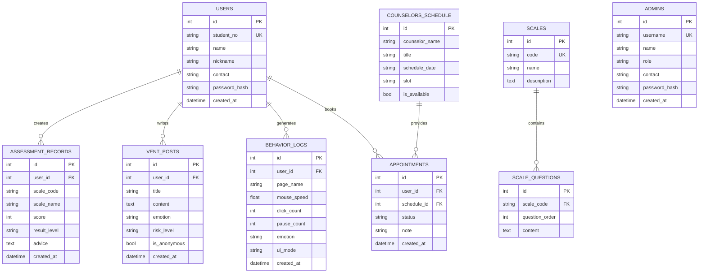

# ER 图源文件

## 1. 用途
- 对应课程报告中的数据库 E-R 图。
- 建议导出为 `fig-11-er-diagram.png` 后插入报告第四章数据库设计部分。

## 2. Mermaid 源码

```mermaid
erDiagram
    USERS ||--o{ ASSESSMENT_RECORDS : creates
    USERS ||--o{ VENT_POSTS : writes
    USERS ||--o{ BEHAVIOR_LOGS : generates
    USERS ||--o{ APPOINTMENTS : books
    COUNSELORS_SCHEDULE ||--o{ APPOINTMENTS : provides
    SCALES ||--o{ SCALE_QUESTIONS : contains

    USERS {
        int id PK
        string student_no UK
        string name
        string nickname
        string contact
        string password_hash
        datetime created_at
    }

    ADMINS {
        int id PK
        string username UK
        string name
        string role
        string contact
        string password_hash
        datetime created_at
    }

    SCALES {
        int id PK
        string code UK
        string name
        text description
    }

    SCALE_QUESTIONS {
        int id PK
        string scale_code FK
        int question_order
        text content
    }

    ASSESSMENT_RECORDS {
        int id PK
        int user_id FK
        string scale_code
        string scale_name
        int score
        string result_level
        text advice
        datetime created_at
    }

    VENT_POSTS {
        int id PK
        int user_id FK
        string title
        text content
        string emotion
        string risk_level
        bool is_anonymous
        datetime created_at
    }

    BEHAVIOR_LOGS {
        int id PK
        int user_id FK
        string page_name
        float mouse_speed
        int click_count
        int pause_count
        string emotion
        string ui_mode
        datetime created_at
    }

    COUNSELORS_SCHEDULE {
        int id PK
        string counselor_name
        string title
        string schedule_date
        string slot
        bool is_available
    }

    APPOINTMENTS {
        int id PK
        int user_id FK
        int schedule_id FK
        string status
        string note
        datetime created_at
    }
```
