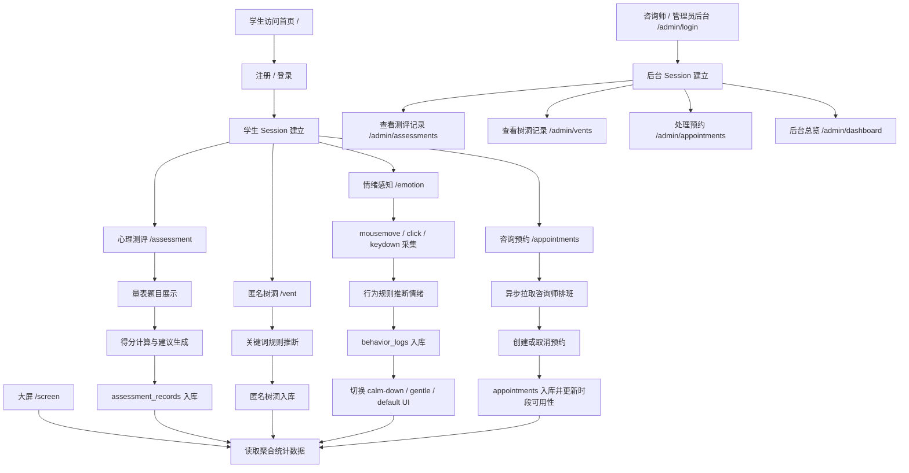

# 系统流程图源文件

## 1. 用途
- 对应课程报告中的系统流程图。
- 建议导出为 `fig-10-system-flow.png` 后插入报告第三章和第四章。

## 2. Mermaid 源码

```mermaid
flowchart TD
    A["学生访问首页 /"] --> B["注册 / 登录"]
    B --> C["学生 Session 建立"]
    C --> D["心理测评 /assessment"]
    C --> E["匿名树洞 /vent"]
    C --> F["情绪感知 /emotion"]
    C --> G["咨询预约 /appointments"]

    D --> D1["量表题目展示"]
    D1 --> D2["得分计算与建议生成"]
    D2 --> D3["assessment_records 入库"]

    E --> E1["关键词规则推断"]
    E1 --> E2["匿名树洞入库"]

    F --> F1["mousemove / click / keydown 采集"]
    F1 --> F2["行为规则推断情绪"]
    F2 --> F3["behavior_logs 入库"]
    F3 --> F4["切换 calm-down / gentle / default UI"]

    G --> G1["异步拉取咨询师排班"]
    G1 --> G2["创建或取消预约"]
    G2 --> G3["appointments 入库并更新时段可用性"]

    H["咨询师 / 管理员后台 /admin/login"] --> I["后台 Session 建立"]
    I --> J["查看测评记录 /admin/assessments"]
    I --> K["查看树洞记录 /admin/vents"]
    I --> L["处理预约 /admin/appointments"]
    I --> M["后台总览 /admin/dashboard"]

    N["大屏 /screen"] --> O["读取聚合统计数据"]

    D3 --> O
    E2 --> O
    F4 --> O
    G3 --> O
```
